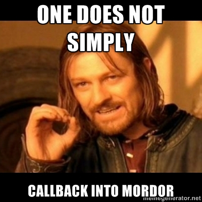

!SLIDE

# Getting started with Backbone and Rails
## 25 things you need to know
### Magma Rails June 6, 2012

!SLIDE

## Follow me on Twitter
[http://twitter.com/leshill](http://twitter.com/leshill)

## Follow me on github
[http://github.com/leshill](http://github.com/leshill)

.notes I write code at CareZone.com in Seattle, I am the co-host of the Ruby 5,
you may have used one of the gems I work on (if you are using Cucumber, try
Turnip), I have been using Ruby and Rails since 2008 and JavaScript since 1996!

!SLIDE

# Why JavaScript client-side frameworks?

.notes Rails 1.0 was released on 2005/12/13
What is driving this?

!SLIDE

# Everybody is doing it

.notes Who uses jQuery, Prototype, or similar?
Who uses Backbone.js, Ember.js, or similar?
These frameworks are seeing lots of use -- apps are going beyond unobtrusive

!SLIDE

# Your JavaScript is out of control

.notes We always used JavaScript, now we have a lot more if it!
Web-apps are evolving into full featured clients
More features == more code

!SLIDE

# Response time matters

> responsiveness is a basic user interface design rule that's dictated by human needs, not by individual technologies

<cite>
  [Jakob Nielsen's Alertbox, June 21, 2010](http://www.useit.com/alertbox/response-times.html)
</cite>

.notes A little UJS to close the flash box is not going to cut it.

!SLIDE

# Backbone.js

[http://backbonejs.org](http://backbonejs.org)

[http://underscorejs.org](http://underscorejs.org)

[http://jquery.com](http://jquery.com)

[http://zeptojs.com](http://zeptojs.com)

.notes One of the original JavaScript MVC frameworks, written by Jeremey
Ashkenas. Backbone is about 2 years old and has a very active community.
And, unusually, without many opinions.
This lack of opinions definitely makes it harder for the novice to jump-in.
Really a very useful library with a thin framework on top. And most apps will need more
You will need more, and this is a good thing.

!SLIDE

# 25 things you need to know about Backbone and Rails

.notes There are many introductory tutorials and screencasts available for
Backbone. You may not have read or seen one yet. That is OK!
This talk is about 25 things you will need to know after the tutorial.

!SLIDE

# 1. Stop using JavaScript

.notes JavaScript might be one of the most successful runtimes in history, available
on all sorts of devices, and really a core part of the Web.
And it is powerful, supporing OOP and functional programming as you see fit
It is easy to gets started with a rich eco-system of libraries and plugins.
All your favorite 'WOW' UIs are using JavaScript
So...

!SLIDE full

.notes This...
Douglas Crockford's JS:TGP
Who has read this book?
If you have not, it would be worth your while to do so

!SLIDE

# Use CoffeeScript

[http://coffeescript.org](http://coffeescript.org)

## Ruby-ish syntax
## Compiles to JavaScript
## Available by default in Rails

.notes CoffeeScipt is an alternative, no scratch that, better syntax for
JavaScript. It was written by Jeremey Ashkenas and the generates code that
adheres to the TGP. CoffeeScript also some nice features baked right into the
language.
It has a nice syntax that is clean and terse
If you take one thing away from this talk: use CoffeeScript

!SLIDE

# 2. MVC

.notes Everyone is familiar with MVC from Rails.
MVC actually originated from a Smalltalk background and user interface widgets -
there is very much a parallel to the JavaScript we are writing today
MVC as a pattern organizes your code around three concepts
The Model represents the application's state
The View displays the apllications's state to the user
The Controller interprets the actions of the user and acts to on the application state
The core of MVC is event handling based on the observer pattern. The
observer pattern allows a subject to notify a list of dependents of state
changes.

!SLIDE

# This is not Rails MVC

.notes Rails has its own opinion about MVC. One difference from the original is
that the Model != Persistence, when we talk about MVC on the client side the
Model often does not even persist.

!SLIDE

# Backbone is not exactly MVC either

.notes So, Backbone does have an opinion, it is event-driven. Backbone is
designed around events. That means that although we do not have a perfect MVC
match, we can discuss Backbone in terms of MVC.
There are four core classes in Backbone:
The Model and Collection classes hold your application state
The View class displays the application state
The View class also interprets the user's actions and acts on the application
state
The Router (indirectly via the Browser location bar) also interprets the user's
actions and acts on the application state

!SLIDE

# 3. Backbone Models are not Rails Models

.notes Avoid thinking of Backbone Models like ActiveRecord Models.  Yes,
Backbone Models support simple persistence via ajax out of the box but think of
Backbone Models as a data bag with event support, this is really useful when
creating your dynamic UI

!SLIDE

# 4. Backbone Models have no validations

.notes There is support for validation built-in, provided by overriding the validate
method. I recommend a Backbone plugin

!SLIDE small

# Backbone.Validations

[https://github.com/n-time/backbone.validations](https://github.com/n-time/backbone.validations)

    @@@coffeescript
    class App.FormView extends App.View
      errors: ->
        required: 'is required'

      errorMessageFor: (key, validation) ->
        @errors()[key]?[validation] || @errors()[validation]

    class App.Views.Movie extends App.FormView
      errors: ->
        _.extend super,
          name:
            required: 'Please enter the name of the movie'

    class App.Models.Movie extends App.Model
      validate:
        name:
          required: true

.notes Backbone.Validations by Neal Stewart
Nice declartive validations with basic validations built-in, and you can add
your own. You have to add your own support for error messages

!SLIDE

# 5. Backbone Collections

.notes Backbone does not have finder class methods on its Models
Models are aggregated by a Collection. Models can be added to a Collection one
at a time or in bulk. When adding, a collection will recognize duplicate
models.

!SLIDE

# Sort your collections

* Specify the comparator
* When you add an item, look at options.index
* When you remove an item, look at options.index

.notes You can use either sortBy 1-arg or sort 2-arg for the comparator,
The Collection will stay in sorted order as you manipulate it

!SLIDE

# 6. Backbone Views are not templates

.notes Backbone views are code that is responisible for air-quote rendering
air-quote the view. You should use templates with your views, and each view
instance should render a template.

!SLIDE

# 7. Backbone Views do not render

.notes Backbone does not force you to use templates, you can bind views
directly to HTML on the page served by Rails. Or you can use templates, but you
have to render them yourself (we will come back to this)
Underscore.js ships with erb-like templating, or...

!SLIDE

# 8. Use Mustache

[http://mustache.github.com](http://mustache.github.com)

.notes Mustache is a logic-less templating system inspired by ctemplates
If you really need helpers, try handlebars.js a superset of Mustache

!SLIDE small

# Mustache Example

## templates/conversations/conversation.hamstache

    .count
      %a(class='conversation' href='')
        {{messageCount}}
      {{#newMessageCount}}
      .new_count
        ({{newMessageCount}})
      {{/newMessageCount}}
    .description
      %a(class='conversation' href='')
        {{between}}
      %span.meta
        &mdash;
        {{> time}}
    %ul.actions
      {{> mute_actions}}

.notes Haml + Mustache == HAMSTACHE!
Mustache supports iteration, conditional sections, and partials

!SLIDE

# 9. Use the Rails asset pipeline

[http://guides.rubyonrails.org/asset_pipeline.html](http://guides.rubyonrails.org/asset_pipeline.html)

.notes Precompilation and compression of all your JS including templates for
faster rendering

!SLIDE

# Precompile your templates!

[https://github.com/leshill/hogan\_assets](https://github.com/leshill/hogan\_assets)

.notes You can precompile your Mustache templates to minimize client-side render times.
Hogan is a Mustache template compiler from Twitter.
hogan\_assets uses Hogan.js to precompile all your templates in the asset pipeline
They are served to the browser ready to render for SPEED!

!SLIDE

# 10. Organize your code

.notes Backbone makes no assumption about the layout of your code. Namespaces
and file organization are up to you.

!SLIDE small

# Namespace your App

## main.js.coffee

    @@@coffeescript
    window.App =
      Collections: {}
      Models: {}
      Presenters: {}
      Views: {}

    $(->
      # Start your app here
    )

.notes Create a namespace for your App, App is a fine choice. Copy the Rails
naming convention
Or not, just use a namespace, you will thank me later

!SLIDE full

# Presenters?

.notes Presenters are not a part of Backbone, more on them later

!SLIDE small

# File Organization

    app/
      assets/
        javascripts/
          app/
            collections/
              { your collections here }
            models/
              { your models here }
            presenters/
              { your presenters here }
            views/
              posts/
                { your views here }
          templates
            posts/
              { your mustache templates here}

.notes Mirror the namespace in the file organization.
Note that templates do not need to be namespaced, but should be organized
similarly to your views

!SLIDE small

# 11. View binding to DOM events

    @@@coffeescript
    class App.Views.Example extends App.View
      events:
          'click a.cancel': 'close'

      close: (event) ->
        event?.preventDefault()
        @hide()

.notes Backbone comes with two types of event support baked in. This is the
events map.  The events map works like jQuery's on events-map. Specify a DOM
event (cannot use focus/blur or change/submit/reset in IE) and a selector as
the key and a callback method as the value
Callback! Take a look at the first line of close(), a nice feature of CS is the
existential operator, which can soak up nulls similar to the andand gem.

!SLIDE small

# 12. Binding to Backbone events

    @@@coffeescript
    class App.Views.Example extends App.View
      initialize: (options) ->
        super
        @model.on('change', @renderAndHighlight, this)

      renderAndHighlight: ->
        @render()
        @$el.effect('highlight', 'slow')

.notes The second type of event support is Backbone.Events.
The Backbone classes: Model, Collection, View, Router, all fire specific events
and your extensions can fire custom events. For example, when an attribute
value changes on a model, Backbone.Model will fire a 'change' event

!SLIDE small

# 13. Backbone.Events

    @@@coffeescript
    callback: (obj, value) ->
      # Do something

    # Start listening
    @obj.on('custom', callback, this)
    # Start listening to any event
    @obj.on('all', callback, this)
    # Stop listening
    @obj.off('custom', callback)

    # Trigger the event
    @obj.trigger('custom', this, value)

.notes The Backbone.Events API is 3 simple methods, on, off, and trigger. And
you can mix Backbone.Events directly into your own classes.

!SLIDE small

# 14. Other types of Callbacks

    @@@coffeescript
    # Using $.ajax
    jqxhr = $.ajax
      url: '/conversations/unread'
      dataType: 'json'
    jqxhr.done @_resync

    # Or using jQuery plugins
    @$('form').fileupload
      url: @uploadUrl()
      dataType: 'json'
      add: @queueFile
      done: @uploadComplete
      fail: @uploadFailed
      send: @uploadStarted
      always: @uploadDone
      replaceFileInput: false

.notes In JavaScript everything uses callbacks. For example, the event loop, or
$.ajax.

!SLIDE

# Callbacks and `this`

* Everyone is bitten by `this`

* JavaScript callbacks are invoked with a `this` parameter

.notes There is one pitfall with JavaScript callbacks. What is `this`? You
might naively expect it to be `this` at the point the callback is defined.

!SLIDE full

.notes JavaScript closures are lexically scoped so all the names in scope at
the point the callback is defined remain available.
All the names except, of course, `this`. It turns out that `this` is
controlled by the caller of the callback, and is passed as the first argument
to apply() or call() when the callback is invoked.

!SLIDE small

# Do not do `this`

    @@@coffeescript
    # Contrived example!
    that = this
    callback = (obj, value) ->
      that.do_something()

    # Start listening
    @obj.on('custom', callback)

.notes Knowing `this`, resist the temptation to work around it by saving `this` to `that`.
Or `self` :)

!SLIDE small

# 15. Event context: View DOM Events

    @@@coffeescript
    class App.Views.Example extends App.View
      events:
          'click a.cancel': 'close'

      close: (event) ->
        # What is `this` inside the callback?
        alert(this)
        # Yes!

.notes When using View.events, Backbone sets `this` for you to the View.

!SLIDE small

# 16. Event context: Backbone.Events

    @@@coffeescript
    class App.Views.Example extends App.View
      initialize: (options) ->
        super
        @model.on('change', @renderAndHighlight)

      renderAndHighlight: ->
        # What is `this` inside the callback?
        alert(this)
        # WAT?!

.notes When not explicitly set as the last parameter, `this` is set to the
triggering object or `@model` in this case

!SLIDE full

!SLIDE small

# Event context: Backbone.Events specifying `this`

    @@@coffeescript
    class App.Views.Example extends App.View
      initialize: (options) ->
        super
        @model.on('change', @renderAndHighlight, this)

      renderAndHighlight: ->
        # What is `this` inside the callback?
        alert(this)
        # High five!

.notes The last parameter to on is the context for the callback, when trigger
calls your callback, it will set `this` to the explicitly passed in context

!SLIDE small

# 17. The Fat Arrow

## `=>` is CoffeeScript binding magic!

    @@@coffeescript
    getUnread: ->
      jqxhr = $.ajax
        url: '/conversations/unread'
        dataType: 'json'
      jqxhr.done @_resync

    _resync: (data, status, jqxhr) =>
      # What is `this` inside the callback?
      alert(this)
      # Awwww Yeeaaa!

.notes The fat arrow binds your method to the defining object, even if it was
invoked as a callback, very useful and worth looking at how CoffeeScript does
this to understand why it works

!SLIDE full

This is one of my favorite CoffeeScript features!

!SLIDE

# WARNING!

# Do not use `=>` EVERYWHERE!

.notes If you do, I will hunt you down, sit down at your keyboard, and type
'gem uninstall coffeescript' Seriously, using it everywhere is a code-smell.
The operator has a specific, very-useful, semantic meaning.

!SLIDE

# 18. Learn and use Underscore.js

.notes Essential support library for JS. You should review all of its
functionality, there are 75-ish methods. For example _.bind if you have a
situation where you cannot use the fat arrow

!SLIDE small

# 19. Write your code with events!

    @@@coffeescript
    class App.Collection extends Backbone.Collection
      selectModel: (model_or_id) ->
        model = if _.isObject(model_or_id)
          @getByCid(model_or_id.cid)
        else
          @get(model_or_id)
        @trigger('select', model)

.notes Really! Events are the heart of MVC and JavaScript in the browser is
already event-driven
If you take another thing away from this talk: emit an event,
do not call a method (let the observers figure it out!)
REMEMBER: CoffeeScript good! Events good!

!SLIDE smaller

# 20. Rendering Mustache

    @@@coffeescript
    class App.View extends Backbone.View
      initialize: (options) ->
        super
        if @options.template?
          @template = @options.template
      html: (html) ->
        @$el.html(html)
        this
      render: ->
        if @template?
          @html(@renderTemplate(@template, @renderContext(), {})))
        this
      renderContext: ->
        @model.toJSON()
      renderTemplate: (template, context, partials) ->
        @_template(template).render context, partials
      _template: (template) ->
        HoganTemplates['templates/' + template]

.notes Back to rendering (from #7)
Take this please. Use it. Improve it. You need something like this.

!SLIDE

# 21. Presenters are a natural fit for Mustache

* Mustache is logic-less and without helpers
* Presenter sits between the model and the template
* Maintains the separation between the Model and View

.notes Which brings us to Presenters!
Mustache renders from a hash of names and values, Rails helper-like
functionality has to happen before passing the hash to Mustache

!SLIDE smaller

# Presenter wraps a model

    @@@coffeescript
    class App.Presenter
      constructor: (model) ->
        @model = model
        (@[key] = value unless @[key]?) for own key, value of @model.attributes
      get: (name) ->
        @model.get(name)

    class App.Presenters.Movie extends App.Presenter
      opening_weekend: ->
        '$' + format '#,##0.00', @get('opening_weekend')

.notes Attributes are exposed directly through the Presenter, and helper like
functionality is added to the presenter, for example formatting a number to
currency

!SLIDE smaller

# Rendering with a Presenter

    @@@coffeescript
    class App.View extends Backbone.View
      initialize: (options) ->
        super
        if @options.template?
          @template = @options.template
        if @options.presenter?
          @presenter = @options.presenter
      render: ->
        if @template?
          @html(@renderTemplate(@template, @renderContext(), {}))
        this
      renderContext: ->
        if @presenter?
          @presenter.apply this, [@model]
        else
          @model.toJSON()
      renderTemplate: (template, context, partials) ->
        @_template(template).render context, partials
      _template: (template) ->
        HoganTemplates['templates/' + template]

.notes Minor change in initialize and renderContext, et voila! Presenters!
Notice the apply for @presenter?

!SLIDE

# 22. Prefer configuration via code over properties

* Passed in as a callback
* Always set the context to the configured object
* Flexibility

.notes Properties are easy, but often limit what is being done
Setting `this` parallels what we do with Ruby configuration objects

!SLIDE smallest

# Configuring a CollectionView

    @@@coffeescript
    class App.CollectionView extends App.View
      initialize: (options) ->
        super
        @view = @options.view
      add: (model, collection, options) ->
        newView = @getView(model).show()
        if options.index == 0
          @container().prepend(newView.$el)
        else
          existingModel = @collection.at(options.index - 1)
          existingView = @getView(existingModel)
          existingView.$el.after(newView.$el)
        @trigger('viewAdded', newView, model, options.index)
      getView: (model) ->
        unless view = @viewCache.get(model)
          view = @view.apply this, [model]
          @viewCache.add(view)
        view

    view = new App.CollectionView
      collection: collection
      el: $('#movie_list')
      view: (model) ->
        new App.Views.Movie
          model: model
          presenter: (model) ->
            new App.Presenters.Movie(model)

.notes The child view is defined via a callback

!SLIDE

# 23. Use deferreds!

    @@@coffeescript
    if jqxhr = @model.save(attrs)
      jqxhr.always (jqxhr, status) =>
        $.rails.enableFormElements(@$('form'))
      jqxhr.done (data, status, jqxhr) =>
        @model = null
        @clearErrors()
        @clearForm()

.notes Model#save,#fetch and #destroy all return a jqxhr now

!SLIDE small

# 24. Rails controllers and single page apps

    @@@ruby
    BackboneAndRails::Application.routes.draw do
      get '/movies', to: 'movies#index'
      get '/movies/new', to: 'movies#index'
      get '/movies/:id', to: 'movies#index'
      root to: 'movies#index'
    end

.notes Support links into the app
Use the Router to show the appropriate UI, the Rails index page needs to
provide all data necessary

!SLIDE

# The Backbone Router

* Updates the browser address bar
* Route events
* Completely optional

.notes Route events can be used to manage visibility for secondary elements of
the UI, for example only showing left hand nav component on detail views

!SLIDE

# 25. It is just code

.notes There is a lot of code being written for the client-side now. SOLID,
design patterns, testing practices all apply

!SLIDE

# Questions?

